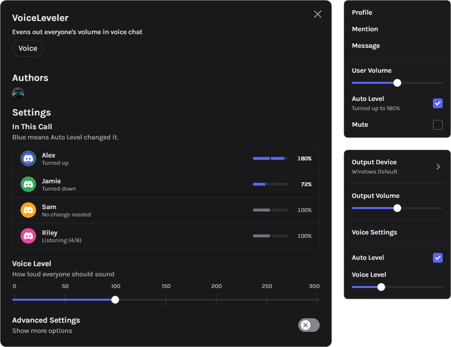

# voiceLeveler

makes everyone in voice about the same volume

## features

- turns quiet people up and loud people down
- you can toggle the **auto level** switch and adjust the **voice level** slider after right clicking the headphone button
- **auto level** control below every user's volume slider
- manually moving a user's volume slider stops auto-leveling for them until you disconnect
- the settings panel shows all participants and their applied volume offsets

## how it works

- discord voice engine already knows how loud every user's voice. the plugin uses this information four times per second
- changes are temporary. your user volume settings are never touched
- it keeps track of how loud users 

## settings

**voice level** controls how loud everyone ends up and is usually the only setting anyone needs to change. but if you wish to tweak advanced settings then just toggle the **advanced settings** switch

| setting | default | |
| --- | --- | --- |
| lowest volume | 50% | floor limit for volume drops |
| highest volume | 200% | ceiling limit for volume boosts |
| noise floor | -45 dB | ignores sounds quieter than this |
| tolerance | 3 dB | ignores small changes so sliders don't jump around |
| wait between changes | 15s | cooldown before adjusting the same person again |
| shout limit | 10 dB | drops their volume fast if they yell |
| remember for | 30 days | how long it remembers each person's data |
| ignore bots | on | for music bots|
| reset auto level | | forgets everyone data and resets to default |

## heads up

- needs between 5 to 10 seconds of speech before making any change. after that it will recognize them and next time around will fix them immediately when they join.
- it works only on the desktop app

## install

if you made it here you probably already know how to install custom plugins, but if not just check [vencord's guide](https://docs.vencord.dev/installing/custom-plugins/) 
